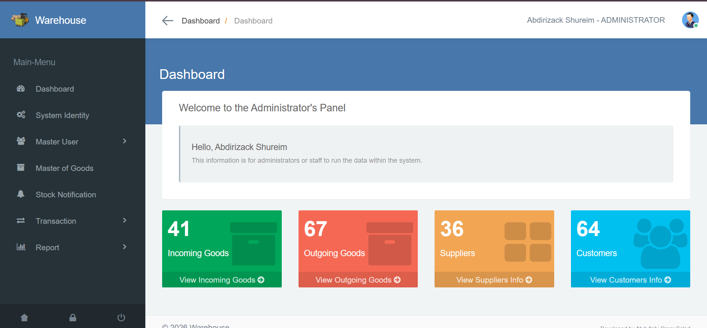
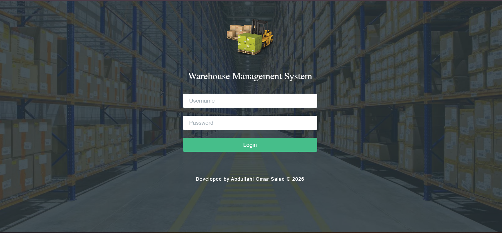
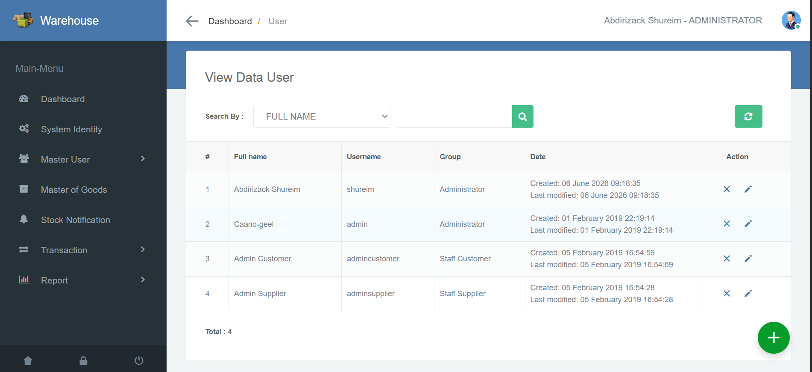
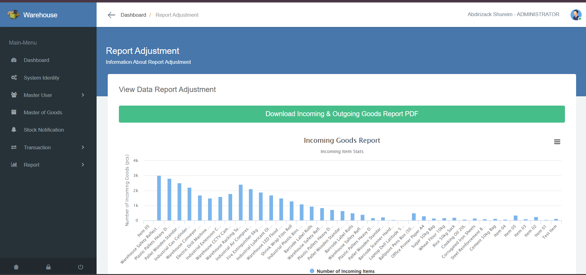

# 🏢 Warehouse Management System (WMS)



A modern **Warehouse Management System (WMS)** developed using **PHP**, **CodeIgniter 3**, **MySQL**, **Bootstrap**, **Dompdf**, and **PhpSpreadsheet**.

The system helps businesses efficiently manage inventory, suppliers, customers, stock movements, and reporting through an intuitive web-based dashboard.

---

## 🌐 Live Demo

**Production URL**

👉 https://warehouse.freedev.app/

---

## ✨ Features

### 📦 Inventory Management

* Add, edit, and delete products
* Track available stock levels
* Real-time inventory updates

### 📥 Incoming Goods

* Record goods received from suppliers
* Automatic stock increment
* Incoming goods reporting

### 📤 Outgoing Goods

* Record goods issued to customers
* Automatic stock deduction
* Outgoing goods reporting

### 👥 Supplier Management

* Manage supplier information
* Store supplier contact details
* Supplier transaction history

### 🧑‍💼 Customer Management

* Manage customer records
* Track customer transactions

### 📊 Dashboard Analytics

* Inventory overview
* Stock statistics
* Business insights

### 📄 Reports

* Incoming Goods Reports
* Outgoing Goods Reports
* Adjustment Reports
* PDF Export Functionality

### 🔐 User Management

* Secure authentication
* Administrative access control

---

# 📸 Screenshots

## Login Page



---

## Dashboard


---

## User Management



---

## Reports



---

# 🛠 Technology Stack

| Technology     | Description               |
| -------------- | ------------------------- |
| PHP            | Backend Development       |
| CodeIgniter 3  | PHP Framework             |
| MySQL          | Database Management       |
| Bootstrap      | Frontend Styling          |
| JavaScript     | Client-side Functionality |
| Dompdf         | PDF Generation            |
| PhpSpreadsheet | Excel Handling            |

---

# 🚀 Local Installation

## Requirements

* PHP 7.4+
* MySQL / MariaDB
* Apache (XAMPP Recommended)
* Composer

## Setup

### 1. Clone Repository

```bash
git clone https://github.com/caano-geel/Warehouse-Management-System.git
```

### 2. Move Project

Place the project inside:

```text
C:\xampp\htdocs\
```

### 3. Create Database

Create a database named:

```text
wmsci
```

### 4. Import Database

Import:

```text
DATABASE FILE/wmsci.sql
```

### 5. Configure Database

Update:

```text
application/config/database.php
```

### 6. Configure Base URL

Update:

```text
application/config/config.php
```

Example:

```php
$config['base_url'] = 'http://localhost/wms/';
$config['index_page'] = 'index.php';
```

### 7. Run Application

Start Apache and MySQL.

Open:

```text
http://localhost/wms/
```

---

# ☁️ Production Deployment

### Hosting Environment

* InfinityFree
* Apache
* PHP 8+
* MySQL

### Steps

1. Upload project files.
2. Create production database.
3. Import SQL file.
4. Update database credentials.
5. Configure production base URL.
6. Enable HTTPS.
7. Test all system modules.

---

# 📂 Main Modules

* Dashboard
* Inventory Management
* Supplier Management
* Customer Management
* Incoming Goods
* Outgoing Goods
* Stock Monitoring
* Reporting System
* PDF Export

---

# 👨‍💻 Developer

### Abdullahi Omar

Software Developer | Computer Science Graduate

GitHub:
https://github.com/caano-geel

---

# 📜 License

This project is provided for educational, learning, portfolio, and business purposes.

---

⭐ If you find this project useful, please consider giving it a star on GitHub.
